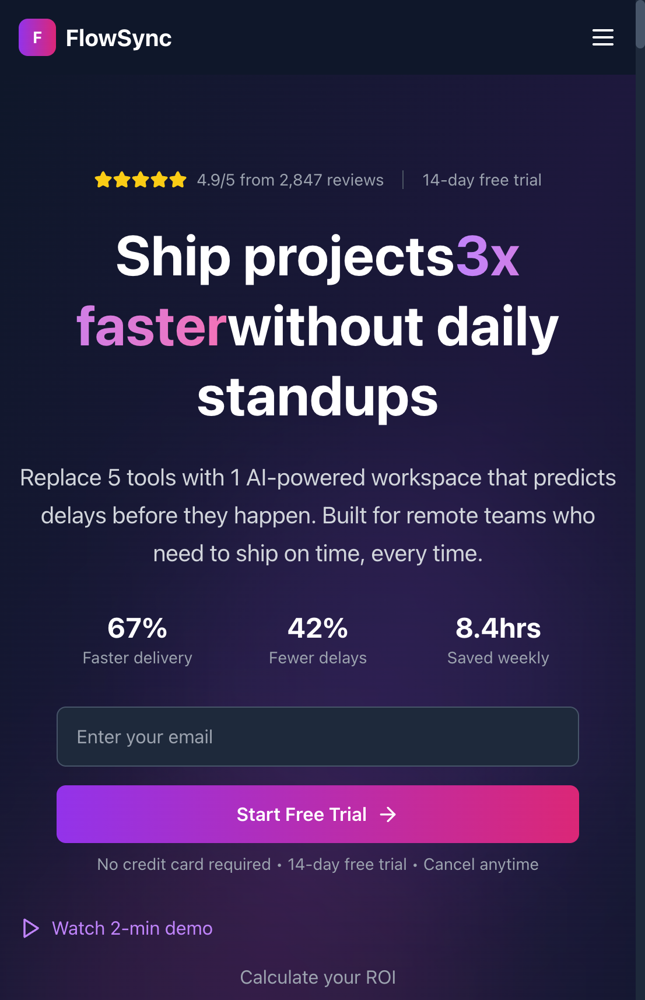

# FlowSync Landing Page

<div align="center">
  
  
  <h3>🚀 Modern SaaS Landing Page</h3>
  <p>A premium, conversion-optimized landing page built with React, TypeScript, and Tailwind CSS</p>
  
  <p>
    
    
    
    
  </p>
</div>

## ✨ Features

### 🎨 Design & UX
- **Responsive Design** - Mobile-first approach, works seamlessly on all devices
- **Dark Theme** - Modern dark color scheme with gradient accents
- **Smooth Animations** - Framer Motion powered animations and transitions
- **Professional SVGs** - Custom-designed avatars, logos, and icons

### 🧩 Components
- **Hero Section** - Eye-catching header with metrics and CTA
- **Features Grid** - Showcase product capabilities with icons
- **Trust Section** - Build credibility with client logos and testimonials
- **Pricing Plans** - Clear, tiered pricing with feature comparison
- **FAQ Accordion** - Searchable, categorized frequently asked questions
- **Integration Showcase** - Display compatibility with popular tools

### 🛠 Technical
- **TypeScript** - Full type safety across the application
- **Component Architecture** - Modular, reusable React components
- **Performance Optimized** - Lazy loading, code splitting, and optimized assets
- **SEO Ready** - Semantic HTML and meta tags
- **Accessibility** - WCAG compliant with proper ARIA labels

## 🚀 Quick Start

### Prerequisites
- Node.js 16+ and npm/yarn
- Git

### Installation

```bash
# Clone the repository
git clone https://github.com/pavelsukhachev/flowsync-landing.git

# Navigate to project directory
cd flowsync-landing

# Install dependencies
npm install

# Start development server
npm start
```

Open [http://localhost:3000](http://localhost:3000) to view in browser.

## 📁 Project Structure

```
flowsync-landing/
├── public/
│   ├── logos/          # Company logos (TechCorp, etc.)
│   ├── icons/          # Review platform icons (G2, Capterra)
│   └── integrations/   # Integration logos (AWS, Docker, etc.)
├── src/
│   ├── components/     # React components
│   │   ├── Navigation.tsx
│   │   ├── Hero.tsx
│   │   ├── Features.tsx
│   │   ├── TrustSection.tsx
│   │   ├── Testimonials.tsx
│   │   ├── Pricing.tsx
│   │   ├── FAQ.tsx
│   │   ├── CTA.tsx
│   │   ├── Footer.tsx
│   │   └── ...
│   ├── App.tsx         # Main application component
│   ├── App.css         # Tailwind imports
│   └── index.tsx       # Application entry point
├── docs/               # Documentation and screenshots
├── package.json        # Dependencies and scripts
└── README.md          # This file
```

## 🎯 Key Components

### Hero Section
- Compelling headline with gradient text
- Product value proposition
- Email capture form with CTA
- Key metrics display
- Trust indicators (star ratings)

### Features Grid
- 6 core features with Lucide React icons
- Hover animations
- Clear benefit statements

### Trust Section
- Company logos carousel
- Security certifications
- User statistics
- Case studies with metrics

### Testimonials
- Auto-rotating carousel
- Professional SVG avatars
- Company and role information
- Star ratings

### Pricing
- 4 pricing tiers (Starter, Pro, Business, Enterprise)
- Monthly/Annual toggle
- Feature comparison
- Clear CTAs

### FAQ
- Searchable interface
- Category filtering
- View count tracking
- Expandable answers

## 🛠 Available Scripts

```bash
npm start       # Run development server
npm test        # Run tests
npm run build   # Build for production
npm run eject   # Eject from Create React App
```

## 🎨 Customization

### Colors
Edit Tailwind config or component styles:
- Primary: Purple/Pink gradients
- Background: Dark slate colors
- Accents: Blue, green highlights

### Content
All text content is in component files - easy to update:
- Company name: "FlowSync"
- Product description in Hero.tsx
- Features in Features.tsx
- Pricing in Pricing.tsx

### Images/Logos
Replace SVG files in public folders:
- `/public/logos/` - Company logos
- `/public/icons/` - Platform icons
- `/public/integrations/` - Tool logos

## 📦 Dependencies

### Core
- React 18.3.1
- TypeScript 5.2.2
- React DOM 18.3.1

### Styling
- Tailwind CSS 3.4.1
- PostCSS 8.4.35
- Autoprefixer 10.4.17

### UI/UX
- Framer Motion 11.0.3
- Lucide React 0.312.0
- @headlessui/react 1.7.18

### Development
- Create React App scripts
- TypeScript definitions
- Testing libraries

## 🚀 Deployment

### Build for Production
```bash
npm run build
```

Creates optimized build in `build/` directory.

### Deploy to GitHub Pages
```bash
# Install gh-pages
npm install --save-dev gh-pages

# Add to package.json
"homepage": "https://pavelsukhachev.github.io/flowsync-landing"

# Deploy
npm run deploy
```

### Deploy to Vercel
```bash
# Install Vercel CLI
npm i -g vercel

# Deploy
vercel
```

## 🤝 Contributing

1. Fork the repository
2. Create feature branch (`git checkout -b feature/AmazingFeature`)
3. Commit changes (`git commit -m 'Add AmazingFeature'`)
4. Push to branch (`git push origin feature/AmazingFeature`)
5. Open Pull Request

## 📄 License

This project is licensed under the MIT License - see the [LICENSE](LICENSE) file for details.

## 🙏 Acknowledgments

- Icons by [Lucide](https://lucide.dev/)
- UI components inspired by modern SaaS platforms
- Animations powered by [Framer Motion](https://www.framer.com/motion/)

---

<div align="center">
  <p>Built with ❤️ using React and Tailwind CSS</p>
  <p>
    <a href="https://github.com/pavelsukhachev/flowsync-landing">View on GitHub</a>
    •
    <a href="https://pavelsukhachev.github.io/flowsync-landing">Live Demo</a>
  </p>
</div>
